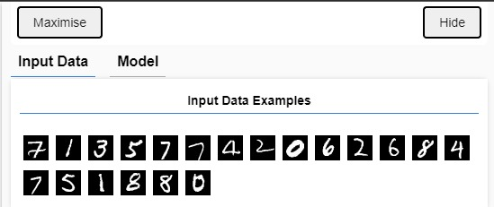
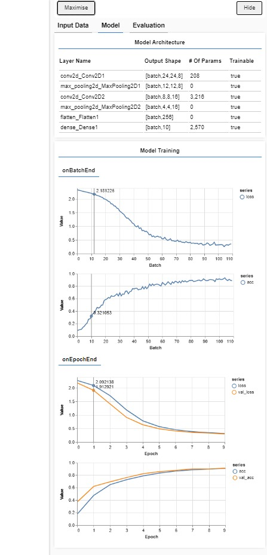
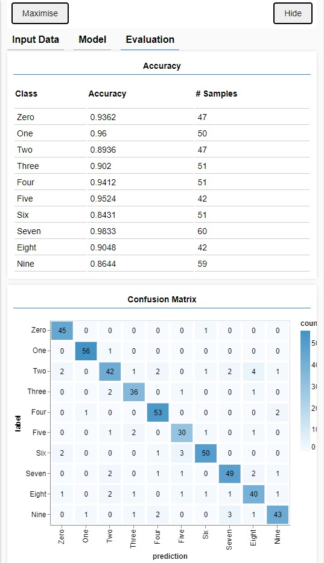

# TensorFlowJs Training

## Introduction

Tensorflow js visualizer model training. This is an example of to see how to visualize in-browers training and model behaviour using tfjs-vis.
This example is made following the tfjs [documentation tutorial](https://storage.googleapis.com/tfjs-vis/mnist/dist/index.html).

## Demos

- To see the explanation and documentation demo go to [documentation tutorial](https://storage.googleapis.com/tfjs-vis/mnist/dist/index.html).

- To see the example demo of this repository go to sergimayol.github.io/TensorFlowJs-Training/.

## Getting started

If you downloaded the code follow this steps:

1. To see working the example run the code on local server.
2. Run the code.
3. Wait a few seconds, and the graphics and data will start to render.
4. Input data, model and evaluation will appear.

## Tree files

```
.
├── LICENSE
├── README.md
├── index.html
└── src
    ├── data.js
    └── script.js
```

## Documentation

To see the documentation go to https://www.tensorflow.org/

## Images




